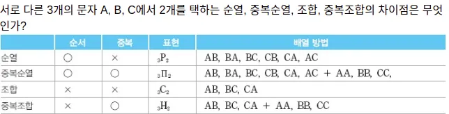

# 완전 탐색

말 그대로 전체를 다 보는 것. 코테에서는 백트레킹을 이용해 상황을 해결

문제 풀때 기본적으로 접근해봐야 함

부분 점수 얻기 좋지만, 시간복잡도가 높아서 만점받기는 힘들 수 있다

## 개념

N개 중
1. 중복없이
2. 중복을 허용

M개를
1. 순서 있게 나열 (AB 와 BA는 서로 다른 것)
2. 고르기 (AB 와 BA는 같다고 친다)



### 중복순열

중복 허용 + 순서 있게

모든 경우의 수를 순서대로 찾는다. 시간복잡도 N^M, 공간복잡도 O(M)

e.g. N = 4, M = 3 (4Pi3)
```
1 1 1
1 1 2
..
1 1 4
..
1 4 4
..
4 4 4
```

=> 3개에 4번씩 나열 (4 * 4 * 4 = 4 ^ 3 <= 4 Pi 3)

```java
int N, int M, int[] selected;
rec_func(int k):
    if k == m : // M개를 모두 고른 경우
      selected[0.. M - 1] // 탐색 결과 나열(N^M 개 중 하나 성공한 것)
    else: 
      for (i = 0; i < N; i++): // N번만큼 반복
        selected[i] = i + 1 // 1 ~ n(0 ~ n-1)까지 k 번 원소로 한 번씩 정하고,
        rec_func(k + 1) // k+1 번 부터 M 번 원소로 재귀호출
        selected[i] = 0 // 이미 골랐으니 안 쓴다
        // => M번까지 탐색 후 돌아오는걸 N번 반복
```

### 순열

중복 없이 + 순서 있게

시간복잡도 N!/(N-M)!

4 P 3
```
1 2 3
1 2 4
1 3 2
1 3 4
...
4 3 1
4 3 2
```

앞에서 고른걸 빼고 골라야 한다.
맨 앞은 4가지 중 하나, 그 다음은 네 가시 고른 중에서 하나를 빼고(3개), 그 다음은 3개중 한개 ... => 4 * 3 * 2 = 4!

```java
int N, int M, int[] selected, boolean[] used;
rec_func(int k):
    if k == m : // M개를 모두 고른 경우
      selected[0.. M - 1] // 탐색 결과 나열(N^M 개 중 하나 성공한 것)
    else: 
      for (i = 0; i < N; i++): // N번만큼 반복
        if !used: // 중복인지 체크(N번만큼 반복할때 이미 선택한거면 빼준다)
          used = true 
          selected[i] = i + 1 // 1 ~ n(0 ~ n-1)까지 k 번 원소로 한 번씩 정하고,
          rec_func(k + 1) // k+1 번 부터 M 번 원소로 재귀호출
          selected[i] = 0 // 이미 골랐으니 안 쓴다
          used = false
```

### 중복 조합

중복 허용 + 순서 상관없이

4 C 3
```
1 1 1
1 1 2
1 1 3
1 1 4
1 2 2  // 1 2 1 은 1 1 2에서 한 번 고름, 2 1 1 도 앞으로 뽑는거 불가능
1 2 3
1 2 4
1 3 3
1 3 4
1 4 4
...
2 2 2 // 2 1 x 는 1 x x 에서 이미 다 고름 (1 x 2, 1 2 x)
...
2 3 3
2 3 4
2 4 4
3 3 3
3 3 4
3 4 4
4 4 4
```
1~4, 1~4, 1~4 이긴 한데... 잘 보면 앞에 나왔던게 다음 M번 탐색에 안 나온다 => 비내림차순

n H r = n+r-1 C r 인데... 대충 때려 맞춰서 N^M 보단 작다고 잡고 간다(때려 맞추되 보수적으로)

> 비 내림차순? 내림차순이 아니다??
>   
> => 앞의 수 보다 뒤의 수가 크거나 같다. 예를 들어 위 예시에서 [0]번으로 2를 뽑았을때 그 뒤에 1이 올 수 없는 것 처럼

```java
int N, int M, int[] selected;
rec_func(int k, start):
    if k == m : // M개를 모두 고른 경우
      selected[0.. M - 1] // 탐색 결과 나열(N^M 개 중 하나 성공한 것)
    else: 
      for (i = start; i < N; i++): // N번만큼 반복인데 이전꺼보다 크거나 같아야 한다 => start 사용
        selected[i] = i + 1 // 1 ~ n(0 ~ n-1)까지 k 번 원소로 한 번씩 정하고,
        int nextStart = i //  다음 시작점은 최소 지금 사용했던 것 부터 출발
        rec_func(k + 1, nextStart) // k+1 번 부터 M 번 원소로 재귀호출
        selected[i] = 0 // 이미 골랐으니 안 쓴다
        // => M번까지 탐색 후 돌아오는걸 N번 반복
```

### 조합

중복 없고 + 순서 상관없게 => 오름차순으로 나열(중복된 수 없게)

N! / M!(N-M)!

> 엄밀한 정의로 오름차순은 이전 값보다 다음 값이 항상 커야 한다. 즉 1, 2, 2, 3 같은 경우는 비 내림차순에 해당할 것이다. 왜냐? 2, 2 는 순서대로 정렬할 수 없기 때문이다. 

```
1 2 3 // 1 1 2, 1 2 2 같은거 안 된다. 뒤의 수가 앞의 수보다 커야 한다.
1 2 4 // 1 3 2 같은거도 안 된다. 1 2 3에서 썼으니까.
1 3 4
2 3 4
```

```java
int N, int M, int[] selected;
rec_func(int k, start):
    if k == m : // M개를 모두 고른 경우
      selected[0.. M - 1] // 탐색 결과 나열(N^M 개 중 하나 성공한 것)
    else: 
      for (i = start; i < N; i++): // N번만큼 반복인데 이전보다 커야 한다 => start 사용
        selected[i] = i + 1 // 1 ~ n(0 ~ n-1)까지 k 번 원소로 한 번씩 정하고,
        int nextStart = i + 1 //  다음 시작점은 최소 지금 사용했던 것의 다음번 부터 출발
        rec_func(k + 1, nextStart) // k+1 번 부터 M 번 원소로 재귀호출
        selected[i] = 0 // 이미 골랐으니 안 쓴다
        // => M번까지 탐색 후 돌아오는걸 N번 반복
```


---

4P2 => 4C2

16개 4^2
```
1,1 1,2 1,3,1,4
2,1 2,2 2,3 2,4
3,1 3,2 3,3 3,4
4,1 4,2 4,3 4,4
```

12개 4P2
```
    1,2 1,3,1,4
2,1     2,3 2,4
3,1 3,2     3,4
4,1 4,2 4,3
```

(1,1) (1,1,1) (1,1,2) 이런걸 빼줘야 한다.

사실은 고를때 부터 빼고 골라줘야 한다. 예를 들어 4개 중에 하나를 뽑고, 그 다음순서에서 3개만 남는다(중복 허용이 안 되니까)

그렇다면 경우의 수는 4 * 3

n! / (n - r)! 로 구할 수 있는데

증명은 아래와 같다

n * (n -1) * (n - 2) ... (n - r + 1) // r개 만큼

n * (n -1) * (n - 2) ... (n - r + 1) * (n - r) * (n - r - 1) * ... 3 * 2 * 1 / (n - r) * (n - r - 1) * ... 3 * 2 * 1

n! / (n - r)!


6개 4C2
```
    1,2 1,3,1,4
        2,3 2,4
            3,4


```

4개 중에 2개만 뽑아야 한다. 순서 상관없이

1 2 3 4

(1, 2), (1, 3), (1, 4) 를 다 뽑았으면 1은 앞으로 나오지 않는다. 

4 3 2 / (2)! 2! = 4 3 / 2!


4C3이면?
(1, 2, 3) (1, 2, 4)  (1, 3, 4) 가 나오고나면 앞으로 1은 못 뽑는다.

4 3 2
3 2 1, 1

4 3 / 3 2

증복이 아니더라도 오름차순이 아닌거 지워줘야 한다. 
1 3 2, 1 4 2, 1 4 3, 
2 1 3, 2 1 4, 2 3 1, 2 4 1, 2 4 3, 
3 1 2, 3 1 4, 3 2 1, 3 2 4, 3 4 1, 3 4 2
4 1 2, 4 1 3, 4 2 1, 4 2 3, 4 3 1, 4 3 2  // 4로 시작하면 무조건 지워야 한다


5C3?

5 4 3 / 3 2 1


