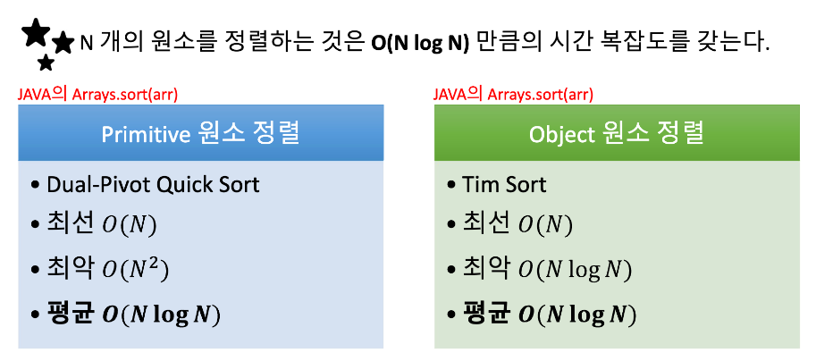
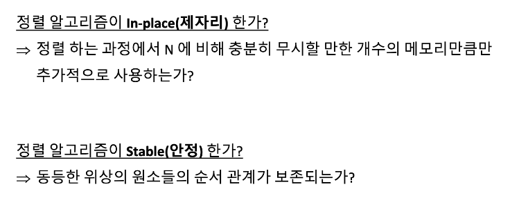
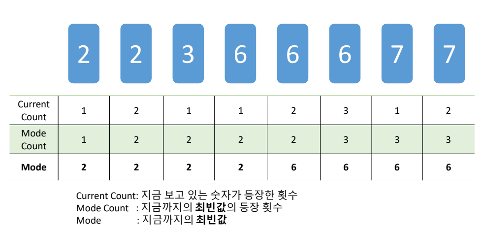

# 정렬

정렬을 하게되면?
- 같은 정보들은 인접해있을 것이다
- 각 원소의 가장 가까운 원소는 양 옆 중 하나이다.
- 정렬만해도 쉽게 풀리는 경우가 많다?

java에서 compare 기본 구조는 이런 형식

```java
//  java.lang.Integer.compare 구현 예시
/**
 * ...
 * @param  x the first int to compare
 * @param  y the second int to compare
 * @return the value 0 if {x == y};
 *         a value less than 0 if {x < y}; and
 *         a value greater than 0 if {x > y}
 */
public static int compare(int x, int y) {
    return (x < y) ? -1 : ((x == y) ? 0 : 1);
}
```

세 가지 경우의 수
1. 결과가 음수 => 왼쪽이 작다
2. 결과가 양수 => 오른쪽이 작다
3. 결과가 0 => 두 개가 같은거

오름차순으로 정렬한다면?
1. 결과가 음수 => 왼쪽이 먼저
2. 결과가 양수 => 오른쪽이 먼저
3. 결과가 0 => 두 개가 같다

결국 `return x - y;` 의 결과 사용하는거랑 마찬가지

Arrays.sort 의 속도?





---

같은 정보들은 인접해있다는 점을 이용하는 법

정렬 한 뒤에 단순 반복으로 같은 정보들의 수를 셀 수 있다 => 최빈값을 구할 수 있다

e.g. 6, 7, 2, 3, 2, 6, 7, 6 의 최빈값?

